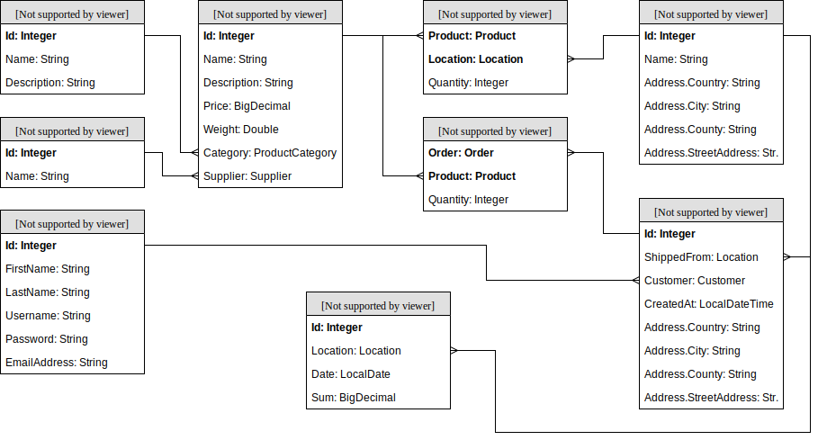

# Spring Training: Resources

## Contents

 - [Working Mode](#working-mode)
 - [Environment](#environment)
 - [Time Bookings](#time-bookings)
 - [Online Shop](#online-shop)
 - [Chapters](#chapters)
   * [0. Java, Git, Maven](#0-java-git-maven)
   * [1. Spring Basics](#1-spring-basics)
   * [2. Spring Boot](#2-spring-boot)
   * [3. JPA and Flyway](#3-jpa-and-flyway)
   * [4. JSON REST APIs](#4-json-rest-apis)
   * [5. Custom Format Support](#5-custom-format-support)
   * [6. Testing](#6-testing)
   * [7. Security](#7-security)
   * [8. REST Template](#8-rest-template)
   * [9. Task Scheduler](#9-task-scheduler)
   * [OPT-1. JDBC](#opt-1-jdbc)
   * [OPT-2. MongoDB](#opt-2-mongodb)
   * [OPT-3. OAuth](#opt-3-oauth)
   * [OPT-4. Olingo](#opt-4-olingo)
   * [OPT-5. MVC with Thymeleaf](#opt-5-mvc-with-thymeleaf)
   * [OPT-6. RabbitMQ](#opt-6-rabbitmq)
   * [OPT-7. Java Mail](#opt-7-java-mail)
   * [OPT-8. WebSocket](#opt-8-websocket)

## Working Mode

The road-map consists of several steps. In each step, a set of theoretical concepts are explored, supported by reference documentation, book chapters, tutorials and videos. In parallel, a simple application will be built with the learned concepts: the *Online Shop* application.

After the learning material for a given step was sufficiently explored, either some new functionality will be added to this application or old functionality will be refactored.

The application will have little-to-no user interface. Developers are expected to perform developer tests with Postman once the REST APIs are implemented.

All the code written must be published on GitHub. Commits must be pushed when each individual chapter is finished. In order to request a code review from the trainers, you must [open a pull request](https://help.github.com/en/articles/creating-a-pull-request) from the `develop` to the `master` branch.

For doing static code quality checks, two separate mechanisms will be used:
 - The plugin for SonarLint and the built-in code analysis must be used to fix code issues.
 - [Codacy](https://www.codacy.com/) will be enabled and developers should check the detected issues periodically. 

## Environment

You can work using your local environment:
 - You need to install [Postman](https://www.getpostman.com/apps), [IntelliJ IDEA (Community)](https://www.jetbrains.com/idea/download/#section=windows), SonarLint and Lombok [plugins for IntelliJ](https://www.jetbrains.com/help/idea/managing-plugins.html#install_plugin_from_repo).
 - If Maven does not work because of SSL errors, [setup the Zscaler certificate in your trust store](https://team.msg.de/site/IT/Freigegebene+Dokumente/Forms/AllItems.aspx?RootFolder=%2fsite%2fIT%2fFreigegebene%20Dokumente%2fAnleitungen%2fZscaler&FolderCTID=0x012000581B900D5D91664C93095DB345EDAFC4).

## Time Bookings

Use the following booking codes to track activities:

| Booking Code                            | Activity                                                                                                          |
|-----------------------------------------|-------------------------------------------------------------------------------------------------------------------|
| Schul. & Einarb. JAVA - allg. Einarb.   | Going through the learning material; tutorials; doing own theoretical investigations; attending presentations.    |
| Schul. & Einarb. JAVA - Impl.-Phase     | Online shop implementation.                                                                                       |
| Schul. & Einarb. JAVA - Komm und JF     | Regular calls, internal discussions (on-boarding, off-boarding).                                                  |

In the booking description, please use the following format: `Chapter: Brief activity description`, for the regular calls, simply state the name of the meeting. 

Examples: `1: Reading about dependency injection, spring basics`, `2: Setting up the project.`.

## Online Shop
The application will deal with the management and daily functioning of a small online shop. Business processes:
 - **Order creation**: an end customer places an order to buy several products (based on the availability of the products in the stock).
 - **Stock management**: the existing product stocks are updated automatically based on the orders placed by customers.
 - **Shop analytics**: the management must be able to view the evolution of the daily revenue for each individual location of the shop.

Throughout the application, we assume that prices are always in EUR and weights are always in KG. 

## Chapters

### 0. Java, Git, Maven

Goal: Getting familiar with the ecosystem around Spring. You can skip this chapter if you have already worked with Java, Git and Maven before.

Required Reading:

 - [Git Basics](https://git-scm.com/book/en/v1/Getting-Started-Git-Basics)
 - [Maven Intro](https://maven.apache.org/what-is-maven.html)
 - [Java 8](https://www.tutorialspoint.com/java8/index.htm)
 - [EditorConfig](https://editorconfig.org/)

Online Shop: *nothing to do*.

Further Resources:

 - [GitHub - Hello World](https://guides.github.com/activities/hello-world/)
 - [Git - CLI Fundamentals](https://www.youtube.com/watch?v=HVsySz-h9r4)
 - [Maven in 5 minutes](https://maven.apache.org/guides/getting-started/maven-in-five-minutes.html)
 - [Guide to Java Reflection](https://www.baeldung.com/java-reflection)

### 1. Spring Basics

Goal: Understand dependency injection and how it is realized with Spring.

Required Reading:

 - [What is Dependency Injection?](https://stackoverflow.com/a/130862/7612556)
 - [Spring - Core Annotations](https://www.baeldung.com/spring-core-annotations)
 - [Spring - Bean Annotations](https://www.baeldung.com/spring-bean-annotations)
 - [Spring - Constructor Injection](https://www.baeldung.com/constructor-injection-in-spring)

Online Shop: *nothing to do*.

Further Resources:

 - [Spring in Action](https://1drv.ms/b/s!AiBPL7npTofshY5PJim4M5RiiOyu7w) - Part 1, Chapter 1
 - [What is Spring all about?](https://www.youtube.com/watch?v=gq4S-ovWVlM)
 - [Spring Reference - Overview](https://docs.spring.io/spring/docs/5.1.6.RELEASE/spring-framework-reference/overview.html#overview)
 - [Spring Reference - Core](https://docs.spring.io/spring/docs/5.1.6.RELEASE/spring-framework-reference/core.html#spring-core) - Chapters 1 to 4

### 2. Spring Boot

Goal: Generate a new project and be able to use the out-of-the-box Spring Boot features.

Required Reading:

 - [Building an Application with Spring Boot](https://spring.io/guides/gs/spring-boot/)
 - [Configuration Properties](https://www.baeldung.com/configuration-properties-in-spring-boot)
 - [Introduction to Lombok](https://www.baeldung.com/intro-to-project-lombok)
 - [Introduction to H2 Database](http://www.topjavatutorial.com/misc/introduction-to-h2-database/)

Online Shop:
 
 > Register an account on GitHub and accept the training [GitHub Classroom Assignment](https://classroom.github.com/a/nnCheGru). This will create a new GitHub repository for you. Clone this repository locally and checkout the `develop` branch. During the course of the training, you will commit and push your work on this branch.
 >
 > Go to "Spring Initializr" and generate a new project:
 > - Group: `ro.msg.learning`,
 > - Artifact: `shop`,
 > - Dependencies: `Web`, `Security`, `JPA`, `Flyway`, `H2`, `Lombok`.
 >
 > Extract the generated `zip` file into the previously cloned repository. Import this project into your IDE. You can delete the `mvnw`, `mvnw.cmd` and `.mvn` files / folders as you have Maven in the IDE anyway.
 >
 > Enable the [H2 console for your application](https://docs.spring.io/spring-boot/docs/2.1.4.RELEASE/reference/html/boot-features-sql.html#boot-features-sql-h2-console) and configure H2 to use a [file-based storage somewhere on your computer](https://stackoverflow.com/questions/37903105/how-to-configure-spring-boot-to-use-file-based-h2-database/37969181#37969181).

Further Resources:
 - [Spring Boot Reference](https://docs.spring.io/spring-boot/docs/2.1.4.RELEASE/reference/html/index.html) - Parts I and II
 - [Spring Boot Tomcat Sample](https://github.com/spring-projects/spring-boot/tree/master/spring-boot-samples/spring-boot-sample-tomcat)
 - [Common Application Properties](https://docs.spring.io/spring-boot/docs/2.1.4.RELEASE/reference/html/common-application-properties.html)
 - [Introduction to SLF4J](https://www.baeldung.com/slf4j-with-log4j2-logback)

### 3. JPA and Flyway

Goal: Initialize the database schema and map the tables to Java classes using JPA.

Required Reading:

 - [Database migrations with Flyway](https://www.baeldung.com/database-migrations-with-flyway)
 - [JPA - Entities](https://docs.oracle.com/javaee/5/tutorial/doc/bnbqa.html)
 - [JPA - JPQL](https://www.tutorialspoint.com/jpa/jpa_jpql.htm)
 - [Introduction to Spring Data JPA](https://www.baeldung.com/the-persistence-layer-with-spring-data-jpa)

Online Shop:
 
 > Create a data model for your application in a Flyway SQL migration. You can refine the model by adding unique indexes (e.g. supplier name) and introducing artificial PKs instead of composite ones and also add a unique index.
 >
 > Translate this data model into Java entity classes. Use Lombok to annotate these classes with `@Data` annotations to generate getters, setters, equals and hashCode. Hint: *it might be useful to create a base entity class (containing just the primary key) or an interface (containing the primary key getter and setter) to be able to handle entities generically later on.*
 > 
 > Annotate all the entities with the proper JPA annotations (`@Entity`, `@OneToMany`, etc). Write Spring Data JPA repositories to allow easy access to your entities. 

Further Resources:
 - [Spring Data Reference](https://docs.spring.io/spring-data/jpa/docs/2.1.6.RELEASE/reference/html/)
 - [Spring Database Initialization](https://docs.spring.io/spring-boot/docs/2.1.4.RELEASE/reference/html/howto-database-initialization.html#howto-execute-flyway-database-migrations-on-startup)
 - [Spring in Action](https://1drv.ms/b/s!AiBPL7npTofshY5PJim4M5RiiOyu7w) - Part 1, Chapter 3.2

### 4. JSON REST APIs

Goal: Group business logic into service classes and expose this logic through REST interfaces.

Required Reading:

 - [What is REST?](https://medium.com/extend/what-is-rest-a-simple-explanation-for-beginners-part-1-introduction-b4a072f8740f) - Parts 1 and 2
 - [Spring REST Tutorial](https://spring.io/guides/tutorials/rest/)
 - [Spring Service Components](https://www.tutorialspoint.com/spring_boot/spring_boot_service_components.htm)
 - [Strategy Design Pattern](https://en.wikipedia.org/wiki/Strategy_pattern)

Online Shop:
 > Create a simple API for exposing the products and product categories: 
 >
 > - Define a DTO (data transfer object) POJO which combines the properties from a product and its respective category. 
 > - Create a service class which uses the repositories in order to: create, update, delete, read by ID and read all the product (as DTO instances).
 > - Build a REST Controller which uses this service.
 >
 > Create a service class that handles the creation of orders. The following constraints apply:
 >
 > - You get a single java object as input. This object will contain the order timestamp, the delivery address and a list of products (product ID and quantity) contained in the order.
 > - You return an Order entity if the operation was successful. If not, you throw an exception.
 > - The service has to select a strategy for finding from which locations should the products be taken. The strategy should be selected based on a `@Configuration`. The following initial strategies should be created: 
 >   - **Single location** - find a single location that has all the required products (with the required quantities) in stock. If there are more such locations, simply take the first one based on the ID.
 >   - **Most abundant** - take each product from the location which has the largest stock for that particular product.
 > - The service then runs the strategy, obtaining a list of objects with the following structure: location, product, quantity (= how many items of the given product are taken from the given location). If the strategy is unable to find a suitable set of locations, it should throw an exception.
 > - The stocks are be updated by subtracting the shipped goods. 
 > - Afterwards the order is persisted in the database and returned.
 > 
 > Create a Rest Controller for the "Create order" operation, which should have a `POST` mapping accepting a JSON request body and producing a JSON response body.
 
Further Resources:

 - [RESTful API Designing Guidelines](https://hackernoon.com/restful-api-designing-guidelines-the-best-practices-60e1d954e7c9)
 - [DDD and Spring](http://static.olivergierke.de/lectures/ddd-and-spring/)
 - [Transaction Management](https://docs.spring.io/spring/docs/5.1.6.RELEASE/spring-framework-reference/data-access.html#transaction)
 - [ConditionalOnProperty](https://docs.spring.io/spring-boot/docs/2.1.4.RELEASE/api/org/springframework/boot/autoconfigure/condition/ConditionalOnProperty.html)
 - [Spring in Action](https://1drv.ms/b/s!AiBPL7npTofshY5PJim4M5RiiOyu7w) - Part 2, Chapter 6

### 5. Custom Format Support

Goal: Add support for a custom data format (CSV) for response bodies.

Required Reading:

 - [Customizing Response Rendering](https://docs.spring.io/spring-boot/docs/2.1.4.RELEASE/reference/html/howto-spring-mvc.html#howto-customize-the-responsebody-rendering)
 - [CSV with Jackson](http://www.cowtowncoder.com/blog/archives/2012/03/entry_468.html)

Online Shop:

 > Create a service class that handles the export of stocks. It has one method for exporting the stock of a given location (input = location ID, output = list of stocks).
 >
 > Create a message converter for CSV handling, using the [Jackson CSV library](https://github.com/FasterXML/jackson-dataformats-text/tree/master/csv). First create a utility class that has the following methods and then wrap it into a subclass of `AbstractGenericHttpMessageConverter`:
 >
 > - `fromCsv`:
 >   - Has a generic type parameter `<T>`, representing the type of the POJOs stored in the CSV,
 >   - Returns a `List<T>`,
 >   - Has a parameter `Class<T>`,
 >   - Has an input stream parameter containing the CSV file.
 > - `toCsv`:
 >   - Has a generic type parameter `<T>`, representing type of the POJOs stored in the CSV,
 >   - Returns `void`,
 >   - Has a parameter `Class<T>`,
 >   - Has a parameter `List<T>`, representing the list of POJOs to be written in the CSV,
 >   - Has an output stream parameter in which the CSV file is written.
 >
 > Create a Rest Controller for the "Export stock" operation with a `GET` mapping producing a CSV response.

Further Resources:

 - [Jackson CSV library](https://github.com/FasterXML/jackson-dataformats-text/tree/master/csv)
 - [HTTP Message Converters](https://www.baeldung.com/spring-httpmessageconverter-rest)

### 6. Testing

Goal: Perform tests of the following types: unit tests, integration tests and API tests.

Required Reading:

 - [Spring Boot Testing](https://www.baeldung.com/spring-boot-testing)
 - [Unit Testing with Spring Boot](https://reflectoring.io/unit-testing-spring-boot/)
 - [Writing Tests in Postman](https://blog.getpostman.com/2017/10/25/writing-tests-in-postman/)

Online Shop:

 > Implement unit tests for the following functionalities:
 >
 > - CSV serialization and de-serialization,
 > - Location strategies.
 >
 > Create a `test` Spring profile which uses an in-memory H2 database instance. 
 >
 > Implement integration tests which use this profile and thus use the in-memory database for the following functionalities:
 >
 > - Create a new order successfully,
 > - Fail to create a new order due to missing stock.
 >
 > Create a `@RestController` enabled just in the `test` profile, which exposes an API for clearing / populating the in-memory database.
 >
 > Implement Postman API tests which use the above-mentioned endpoint to set-up / tear-down the tests, for the following functionalities:
 >
 > - Create a new order successfully,
 > - Export the stocks,
 > - Fail to create a new order due to missing stock,
 > - Fail to create a new order due to unknown product ID(s).

Further Resources:
 
 - [Self-Contained Testing Using an In-Memory Database](https://www.baeldung.com/spring-jpa-test-in-memory-database)
 - [Test Pyramid](https://martinfowler.com/bliki/TestPyramid.html)
 - [Spring Boot Testing Reference](https://docs.spring.io/spring-boot/docs/2.1.4.RELEASE/reference/html/boot-features-testing.html)
 - [Postman Scripts Reference](https://learning.getpostman.com/docs/postman/scripts/intro_to_scripts)

### 7. Security

Goal: Secure your application with HTTP Basic Authentication and Form Based Authentication.

Required Reading:

 - [Spring Security Hello World Guide](https://docs.spring.io/spring-security/site/docs/5.1.5.RELEASE/guides/html5/helloworld-boot.html)
 - [Spring Security Basic Authentication](https://www.baeldung.com/spring-security-basic-authentication)

Online Shop:

 > Implement a custom `UserDetailsService` which retrieves usernames and passwords from your database.
 >
 > Build two Spring configurations for securing your application: one with HTTP Basic and one with Form based login. These configurations should be active based on a Spring profile (e.g. `with-basic` and `with-form`) or based on a property such that only one of them is active at a time.
 >
 > Adjust your Postman Tests to also handle authentication.

Further Resources:

 - [Web Authentication Methods Explained](https://blog.risingstack.com/web-authentication-methods-explained/)
 - [Spring in Action](https://1drv.ms/b/s!AiBPL7npTofshY5PJim4M5RiiOyu7w) - Part 1, Chapter 4

### 8. REST Template

Goal: Consume an external API using REST Templates.

Required Reading:

 - [The Guide to RestTemplate](https://www.baeldung.com/rest-template)

Online Shop:

 > Implement a new greedy strategy that selects locations based on the proximity to the delivery address:
 >
 > - Find the location which is the closest to the order's delivery address. 
 > - Take all the available needed products from that location.
 > - Until we have all the products we need, repeat the above steps (by going to the second closest location, then to the third and so on).
 >
 > To compute the distances, use the [MapQuest route matrix API](https://developer.mapquest.com/documentation/directions-api/route-matrix/post/). You will first need to [register on the MapQuest site](https://developer.mapquest.com/plan_purchase/steps/business_edition/business_edition_free/register) and obtain an API Key.

Further Resources:

 - [Spring REST Client Example](https://howtodoinjava.com/spring-restful/spring-restful-client-resttemplate-example/)
 - [Spring in Action](https://1drv.ms/b/s!AiBPL7npTofshY5PJim4M5RiiOyu7w) - Part 2, Chapter 7.1

### 9. Task Scheduler

Goal: Schedule a simple task to run periodically.

Required Reading:

 - [Scheduling Tasks](https://spring.io/guides/gs/scheduling-tasks/)

Online Shop:

 > The owner of the Online Shop wants to see a sales report every morning for the day before. To cater for this requirement, create a periodical job that runs at the end of each day. It should aggregate all the sales revenues for each location for that day and store the result into the *Revenue* database table. 
 >
 > Create a `@RestController` with a `GET` mapping for exporting the revenue data for a given date.

Further Resources:

 - [Spring Scheduled Tasks](https://www.baeldung.com/spring-scheduled-tasks)
 - [Scheduling Reference Documentation](https://docs.spring.io/spring/docs/5.1.6.RELEASE/spring-framework-reference/integration.html#scheduling)

### OPT-1. JDBC

Goal: Implement repositories manually and become familiar with JDBC.

Required Reading:

 - [Spring JDBC Template](https://www.baeldung.com/spring-jdbc-jdbctemplate)

Online Shop:

 > Write Repository implementations using JDBC for the following tables: `Product`, `ProductCategory` to replace the automatically generated Spring Data repositories.

Further Resources:

 - [Accessing Relational Data using JDBC with Spring](https://spring.io/guides/gs/relational-data-access/)
 - [Spring Data Access with JDBC Reference](https://docs.spring.io/spring/docs/5.1.6.RELEASE/spring-framework-reference/data-access.html#jdbc)

### OPT-2. MongoDB

Goal: Store unstructured data in a NoSQL database.

Required Reading:

 - [NoSQL Databases](https://searchdatamanagement.techtarget.com/definition/NoSQL-Not-Only-SQL)
 - [What is MongoDB?](https://www.mongodb.com/what-is-mongodb)
 - [Accessing Data with MongoDB](https://spring.io/guides/gs/accessing-data-mongodb/)

Online Shop:

 >

Further Resources:

 - [Spring MongoDB Reference](https://docs.spring.io/spring-data/mongodb/docs/2.1.6.RELEASE/reference/html/)

### OPT-3. OAuth

Goal: Secure the online shop with OAuth 2.0.

Required Reading:

 - [The Simplest Guide to OAuth 2.0](https://medium.com/@darutk/the-simplest-guide-to-oauth-2-0-8c71bd9a15bb)
 - [Authorization Server Reference](https://docs.spring.io/spring-security-oauth2-boot/docs/2.1.4.RELEASE/reference/html/boot-features-security-oauth2-authorization-server.html)
 - [Resource Server Reference](https://docs.spring.io/spring-security-oauth2-boot/docs/current/reference/html/boot-features-security-oauth2-resource-server.html)
 - [Spring Boot OAuth 2 Guide](https://spring.io/guides/tutorials/spring-boot-oauth2/)

Online Shop:

 > Configure your application as an *Authorization Server* with an in-memory store of clients. Use Postman to test that you are able to issue a token using the `password` grant.
 >
 > Now also configure your application as a *Resource Server* and secure your REST APIs using OAuth.
 >
 > Lastly, enable your application to additionally use the GitHub Authorization Server. To do this, you will first need to [register a new OAuth app on GitHub](https://developer.github.com/apps/building-oauth-apps/creating-an-oauth-app/) or contact the trainers for obtaining the credentials of an existing client.

Further Resources:

 - [Spring OAuth 2 Developers Guide](https://projects.spring.io/spring-security-oauth/docs/oauth2.html)
 - [Spring SSO vs Resource Server](https://www.baeldung.com/spring-security-oauth2-enable-resource-server-vs-enable-oauth2-sso)

### OPT-4. Olingo

Goal: expose a subset of the existing business logic via OData services.

Required Reading:

 - [Intro to OData](./documents/intro-to-odata.pdf)
 - [Olingo OData 2](https://olingo.apache.org/doc/odata2/index.html)
 - [OData v2 Examples](./examples/odata)

Online Shop:

 > Expose the following entities through a JPA-based OData service:
 >
 > - Order
 > - OrderDetails
 > - Product
 >
 > Use the [JPA-EDM XML mapping](https://olingo.apache.org/doc/odata2/tutorials/jparedefinemetadata.html) to exclude the unneeded JPA entities from the service, exclude any fields of type `LocalDate` or `LocalDateTime` and rename the entities and fields to conform to an UpperCamelCase naming convention.
 >
 > Create another separate OData service (with a separate Service Factory and separate Servlet) using the core processor. You will have to manually define a `EmdProvider` and a `ODataSingleProcessor` This service should expose the "create order" operation. 
 > 
 > Because for creating a new order, you must pass as an input a collection of products and quantities, you should use a *deep insert* OData operation. A deep insert is simply a regular *create* call with also passes the children entities).

### OPT-5. MVC with Thymeleaf

Goal: Build a simple user interface for the online shop.

Required Reading:

 - [Spring MVC Tutorial](https://www.baeldung.com/spring-mvc-tutorial)
 - [Spring Boot CRUD with Thymeleaf](https://www.baeldung.com/spring-boot-crud-thymeleaf)
 - [Introduction to Thymeleaf with MVC](https://www.baeldung.com/thymeleaf-in-spring-mvc)

Online Shop:

 > Create a set of `@Controllers` and views to build-up a simple U.I. covering the following features:
 >
 > - Login and logout,
 > - Browse products and "add to cart",
 > - View "cart" contents and submit order.

Further Reading:

 - [Using Thymeleaf Documentation](https://www.thymeleaf.org/doc/tutorials/3.0/usingthymeleaf.html)
 - [Thymeleaf Spring Documentation](https://www.thymeleaf.org/doc/tutorials/3.0/thymeleafspring.html)
 - [Guide: Handling Form Submission](https://spring.io/guides/gs/handling-form-submission/)

### OPT-6. RabbitMQ

Goal: Asynchronously communicate with a background worker application.

Required Reading:

 - [Understanding Message Brokers](https://www.3pillarglobal.com/insights/rabbitmq-understanding-message-broker)
 - [Spring AMQP Tutorial](https://www.rabbitmq.com/tutorials/tutorial-one-spring-amqp.html)

Online Shop:

 >

Further Resources:

 - [Spring AMQP Reference](https://docs.spring.io/spring-amqp/docs/2.1.5.RELEASE/reference/)
 - [An Introduction to Message Brokers](https://medium.com/@xaviergeerinck/an-introduction-to-message-brokers-9bd203b4ebbd)

### OPT-7. Java Mail

Goal: Send confirmation emails to customers when orders are created.

Required Reading:
 
 - [Guide to Spring Mail](https://www.baeldung.com/spring-email)
 - [Spring Expression Language](https://docs.spring.io/spring/docs/current/spring-framework-reference/core.html#expressions)

Online Shop:

 > Create a `@Service` class for sending email messages with both HTML and plain text bodies. The bodies and subject should be configurable via application properties, whilst the bodies should contain SpEL placeholders which should be replaced at runtime by parsing and evaluating the SpEL expressions.
 >
 > Register an account on [mailtrap.io](https://mailtrap.io) and use the `Default Inbox` credentials to connect to their SMTP server.
 >
 > Lastly, use the email service created previously to send confirmation emails to customers once an Order has been successfully created.

Further Resources:

 - [Sending Emails with Java](https://www.baeldung.com/java-email)
 - [Spring Email Reference](https://docs.spring.io/spring/docs/5.1.6.RELEASE/spring-framework-reference/integration.html#mail)

### OPT-8. WebSocket

Goal: Publish events though WebSocket to allow potential user interfaces to automatically update their displayed data.

Required Reading:

 - [What are WebSockets](https://pusher.com/websockets)
 - [An Introduction to WebSocket](https://blog.teamtreehouse.com/an-introduction-to-websockets)
 - [Using WebSocket to build an interactive web application](https://spring.io/guides/gs/messaging-stomp-websocket/)

Online Shop:

 >

Further Resources:

 - [Intro to WebSockets with Spring](https://www.baeldung.com/websockets-spring)
 - [Spring WebSocket Reference](https://docs.spring.io/spring/docs/5.1.6.RELEASE/spring-framework-reference/web.html#websocket)
